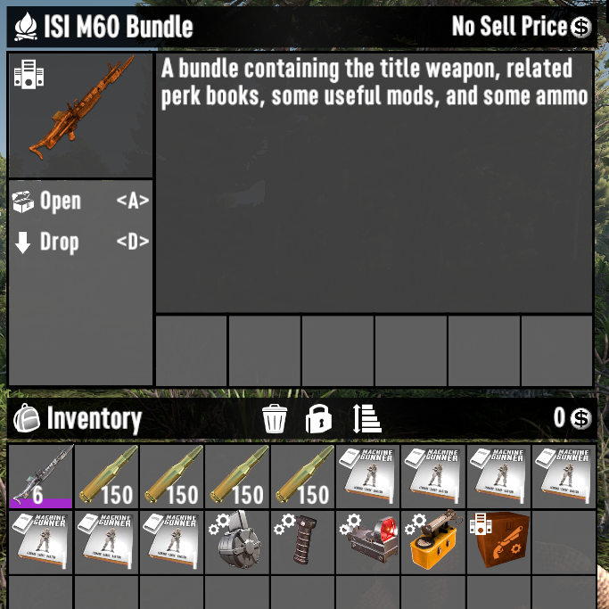
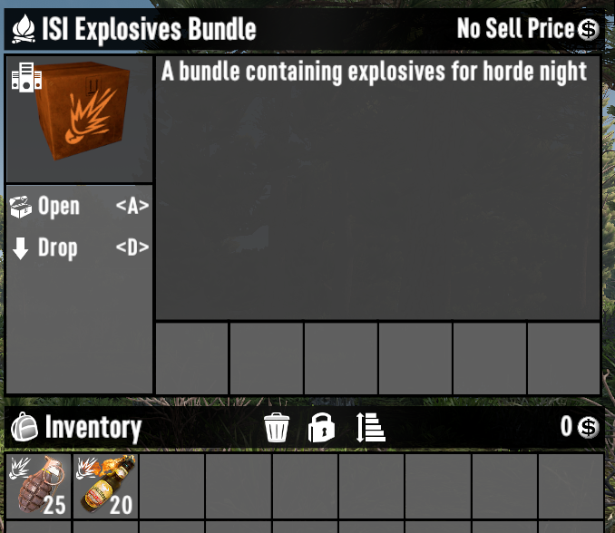
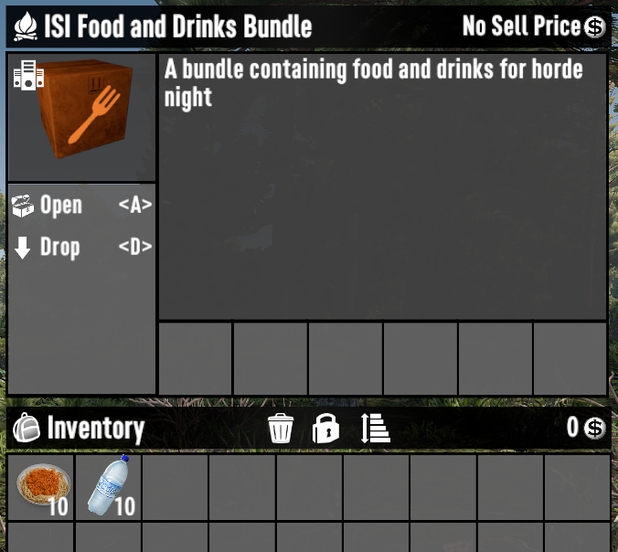
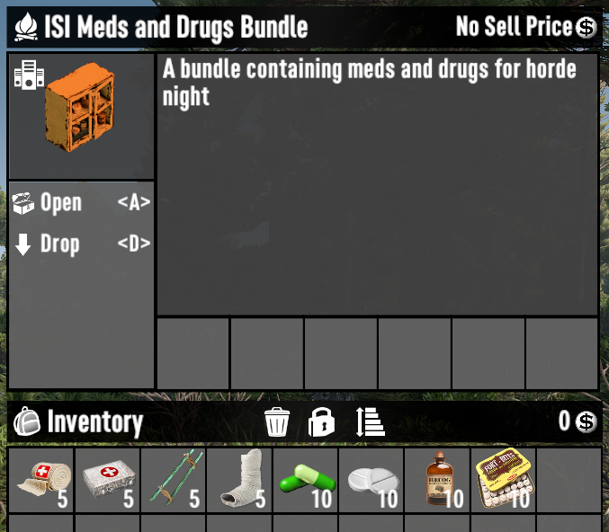

# ISI Horde Base Testing Bundles

A 7 Days to Die (7D2D) mod that adds some bundles to simplify preparing to test a horde base in dev mode.

## How to use

The bundles only appear in the creative menu.

- `F1` - Hit `F1` to open the console
- `cm` - Type `cm` then hit `Enter` to enable creative mode
- `u` - Hit `Close` (or hit `ESC`) to close the console, then hit `u` to open the creative menu
- Search for `isi`


## Bundle Contents

- XP to get to level 300
- A set of tier 6 armor 
- A melee weapon with mods, and relevant perk books 
- A ranged weapon with mods, relevant perk books, and ammo 
- Explosives 
- Food and Drink 
- Meds and Drugs 
- Repair supplies 

## Customizing

If you would like to use a different armor, melee weapon, or ranged weapon bundle you can edit the `isiHordeNightBundle` in [items.xml](Config/items.xml).

For example, if you would like the bundle to include the lumberjack armor instead of the preacher armor, you would just replace `isiPreacherArmorBundle` with `isiLumberjackArmorBundle`

```xml
<item name="isiHordeNightBundle">
    <property name="Extends" value="isiBundle"/>
    <property name="CustomIcon" value="bundleDartTrap"/>
    <property name="DescriptionKey" value="isiHordeNightBundleDescription"/>
    <property class="Action0">
        <property name="Create_item" value="
            giveXP_T300_admin,
            isiPreacherArmorBundle,
            isiClubBundle,
            isiM60Bundle,
            isiExplosivesBundle,
            isiFoodBundle,
            isiMedicalBundle,
            isiRepairBundle"/>
        <property name="Create_item_count" value="1"/>
    </property>
</item>
```

To change the mods, ammo, or books included in the bundles, you can edit the appropriate bundle in the same file.

For example, if you wanted to replace the club bundles Metal Chain mod with the Metal Spikes mod the you would replace `modMeleeClubMetalChain` with `modMeleeClubMetalSpikes` in the `isiClubBundle` item.

```xml
<item name="isiClubBundle">
    <property name="Extends" value="isiMacheteBundle"/>
    <property name="CustomIcon" value="meleeWpnClubT3SteelClub"/>
    <property class="Action0">
        <property name="Create_item" value="
            meleeWpnClubT3SteelClub,
            bookBatterUpBigHits,bookBatterUpStealingBases,bookBatterUpSlowPitch,bookBatterUpKnockdown,bookBatterUpMaintenance,bookBatterUpFoulBalls,bookBatterUpMetalChain,
            modMeleeClubBurningShaft,modMeleeClubMetalChain,modMeleeWeightedHead,modMeleeErgonomicGrip"/>
        <property name="Create_item_count" value="6"/>
    </property>
</item>
```

PS: Please note that if you add, remove, or change the order of items in `Create_item` you may need to update `Create_item_count` as well. If a value has not been specified then it will default to 1 of the item in the corresponding slot.

PPS: While `Create_item_count` usually refers to the number of items, for some items (like armor pieces and weapons) it refers to the quality of the item. In those situations the only way to add additional pieices is to list the item again.
